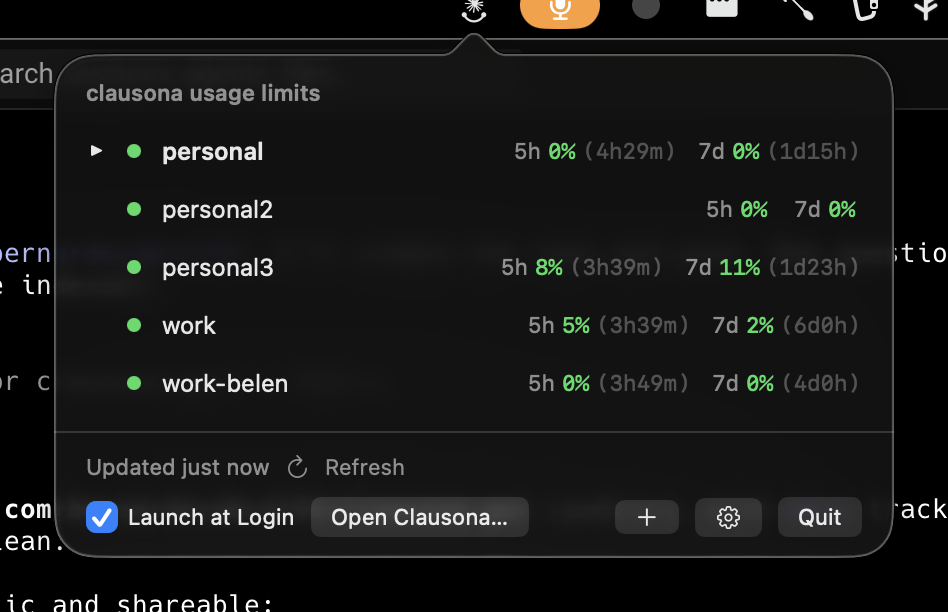
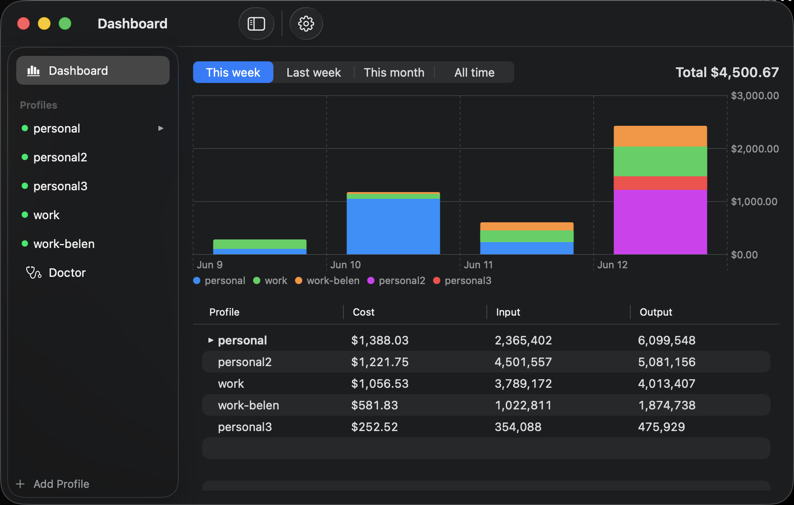
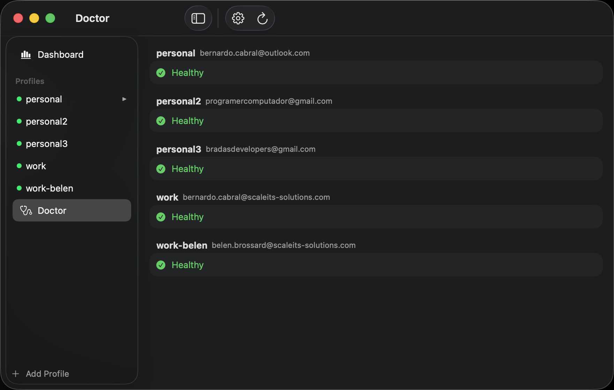

# Clausona

A native macOS menu bar app for [clausona](https://github.com/larcane97/clausona),
the Claude Code profile manager. See every profile's Claude rate-limit windows at a
glance, switch the active profile, watch your usage and cost, and keep profiles
healthy — without leaving the menu bar.

<p align="center">
  
</p>

## Features

**Menu bar popover** — opens on click or with **⌃⌥⌘L**.

- 5-hour and 7-day utilization per profile, color-coded (green / orange / red) with reset countdowns, exactly like the `clausona-limits` CLI.
- One-click profile switching (hover a row → **Use**).
- A health dot per profile; hover an unhealthy one → **Repair**.
- Expired logins are **refreshed silently** in the background — no browser round-trip unless the credential is genuinely revoked.
- Launch at Login toggle.

**Main window** — usage dashboard, profile detail, and doctor.

| Dashboard | Doctor |
| --- | --- |
|  |  |

- **Dashboard:** cost-per-day stacked chart and per-profile cost / token totals over This week · Last week · This month · All time. Totals match `clausona list`. Updates live as sessions run.
- **Profile detail:** account, org, config dir (click to reveal in Finder), credential expiry, current limits, and usage for the selected range.
- **Doctor:** the full `clausona doctor` picture with one-click repair per profile.

**Lifecycle handoffs** — add, re-authenticate, configure, remove, and initial setup
open the right `clausona` command in your terminal (Terminal.app, Warp, or iTerm2);
the GUI updates automatically the moment the flow finishes.

## Requirements

- macOS 14 (Sonoma) or later.
- [clausona](https://github.com/larcane97/clausona) installed (`~/.local/bin/clausona` or on your `PATH`). The app degrades gracefully without it — usage limits still work; switching, repair, and lifecycle flows are hidden.

## Install

### From the release (recommended)

1. Download `Clausona.dmg` from the [latest release](https://github.com/bernardocabral04/clausona-gui/releases/latest).
2. Open it and drag **Clausona** to **Applications**.
3. First launch only: the app is ad-hoc signed (not notarized), so **right-click → Open** to get past Gatekeeper, then confirm.
   - If macOS still refuses, clear the quarantine flag:
     ```sh
     xattr -dr com.apple.quarantine /Applications/Clausona.app
     ```

The icon appears in the menu bar (there is no Dock icon).

### From source

Building locally avoids Gatekeeper entirely.

```sh
git clone https://github.com/bernardocabral04/clausona-gui.git
cd clausona-gui
make install      # builds release and installs to ~/Applications/Clausona.app
open ~/Applications/Clausona.app
```

Other targets: `make test` (run the suite), `make app` (build the bundle into `dist/`), `make dmg` (build the installer), `make clean`.

## How it works

Clausona is a SwiftPM app (AppKit `NSStatusItem` + `NSPopover`, SwiftUI content).

- **Reads** go straight to the underlying state: `~/.clausona/profiles.json`, the macOS keychain (via `/usr/bin/security` — the ACL you already authorized for terminal use, so no new prompts), the OAuth usage endpoint, and `~/.clausona/usage.json`.
- **Mutations** (switch, repair) shell out to the `clausona` CLI; interactive flows (add/login/remove/init/config) hand off to your terminal.
- Access tokens live in memory only and are never logged, written, or shown. Silent refresh renews them against the same endpoint Claude Code uses and writes the result back to the keychain, preserving every field.

No telemetry, no network calls beyond Anthropic's usage and token endpoints.

## Privacy & security

No credentials are stored by this app or this repository — tokens are read from the
keychain at runtime and kept only in memory. The repo contains source, design specs,
and plans only.

## License

Personal project by Bernardo Cabral. clausona itself is a separate third-party tool.
